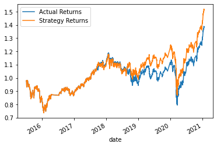
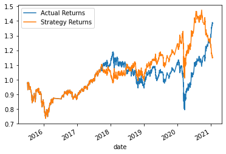

# algorithmic-trading-bot

This application improves the existing algorithmic trading systems and maintain a firm's competitive advantage in the market.

Analysis include

- Implement an algorithmic trading strategy that uses machine learning to automate the trade decisions.
- Adjust the input parameters to optimize the trading algorithm
- train a new machinelearning model and compare its performance to that of a baseline model

     <br>

## Table of Contents

1. [Report](#Report)
1. [Project Links](#Project-Links)
1. [Contribution Guidelines](#Contribution-Guidelines)
1. [Project Team](#Project-Team)
1. [Questions](#Questions)
1. [License](#License)

## Report

#### Summary

- The logistic regression & svc approach outperformed the baseline

 

## Project Links

[Repo Link](https://github.com/robel-codes/algorithmic-trading-bot) <br>

## Contribution Guidelines:

```
Feel free to contribute to this repo by creating issues or sending an email to any of the contributors in the list below.
```

## Project Team

[Robel Gebremeskel](https://github.com/robel-codes) <br>

## Questions

<details>
    <summary>Contact</summary>
    rofikre@yahoo.com <br>
</details>

## License

#### Distributed under the MIT License. See [Choose A License](https://choosealicense.com/) for more details.
